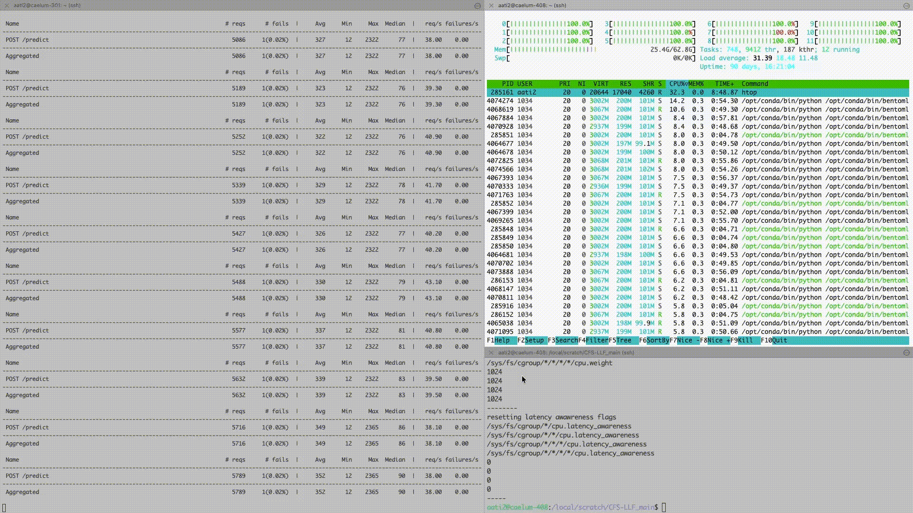

## Cluster experiments overview

## Results

LLF increases throughput by 26% and 12% compared to CFS and EEVDF respectively. This improvement does not come at the expense of latency. Instead, latency decreases by around 6× for both median and tail metrics.


| Scheduler | Report                                                                                                                            | Latency (ms) | RPS  | Total Requests |
| --------- | --------------------------------------------------------------------------------------------------------------------------------- | ------------ | ---- | -------------- |
| CFS-LLF   | [View Report](https://htmlpreview.github.io/?https://github.com/isstaif/CFS-LLF_main/blob/main/cluster/locust-report-cfsllf.html) | 54–210       | 47.5 | 8550           |
| CFS       | [View Report](https://htmlpreview.github.io/?https://github.com/isstaif/CFS-LLF_main/blob/main/cluster/locust-report-cfs.html)    | 590–1800     | 37.6 | 6770           |

| Scheduler | Report                                                                                                                            | Latency (ms) | RPS  | Total Requests |
| --------- | --------------------------------------------------------------------------------------------------------------------------------- | ------------ | ---- | -------------- |
| EEVDF-LLF   | [View Report](https://htmlpreview.github.io/?https://github.com/isstaif/CFS-LLF_main/blob/main/cluster/locust-report-cfsllf.html) | 54–210       | 47.5 | 8550           |
| EEVDF     | [View Report](https://htmlpreview.github.io/?https://github.com/isstaif/CFS-LLF_main/blob/main/cluster/locust-report-eevdf.html)  | 280–1100     | 42.3 | 7609           |


The joint improvement in throughput and latency can be attributed not to a typical throughput–latency trade-off, but to the mitigation of CPU overhead. A detailed root-cause analysis is presented in Section §3.1 of our [paper](https://arxiv.org/abs/2508.15703), based on the `resctl` open-loop benchmark and `ftrace` kernel instrumentation. 

The demo below illustrates the CPU overhead problem, where a significant portion of CPU time is spent within the kernel scheduler itself (i.e., the schedule() function), causing the CPU to appear fully utilized. Under LLF, after mitigating this overhead, the average effective CPU utilization is reduced to around 40%.




## Workload generation and data collection
Locust script  on the workload generator server (not part of the cluster):

```bash
locust --host http://10.97.232.9 --headless --users 100 --spawn-rate 10  --run-time 3m --html=locust-report-cfs.html --csv=locust-results-cfs
locust --host http://10.97.232.9 --headless --users 100 --spawn-rate 10  --run-time 3m --html=locust-report-cfsllf.html --csv=locust-results-cfsllf
```

```bash
locust --host http://10.97.232.9 --headless --users 100 --spawn-rate 10  --run-time 3m --html=locust-results/eevdf.html --csv=locust-results/eevdf
locust --host http://10.97.232.9 --headless --users 100 --spawn-rate 10  --run-time 3m --html=locust-results/eevdfllf.html --csv=locust-results/eevdfllf
```

On the worker machine:

CFS
```
./scripts/setup_patch_clean_cfs.sh
sar -u 10 18 > locust-cpu-cfs
```

CFS-LLF
```
./scripts/setup_patch_clean_k8s.sh 1000
sar -u 10 18 > locust-cpu-cfsllf
```

EEVDF
```
./scripts/setup_patch_clean_eevdf.sh
sar -u 10 18 > locust-cpu-eevdf
```

EEVDF-LLF
```
./scripts/setup_patch_clean_k8s.sh 1000
sar -u 10 18 > locust-cpu-eevdfllf
```

```
curl  -v -H "Host: pytorch-classifier-1.default.example.com" -i -X POST "http://10.97.232.9/predict" -F image=@/local/scratch/jackson-1-part2-profiles/jackson-1-part2-5h50m/720p/002825.jpg
```

## Cluster and control plane setup

Knative service (control plane):

```
kubectl --namespace kourier-system get service kourier
NAME      TYPE           CLUSTER-IP    EXTERNAL-IP   PORT(S)                      AGE
kourier   LoadBalancer   10.97.232.9   <pending>     80:30712/TCP,443:31085/TCP   161d
```

```
curl -v  -H "Host: pytorch-classifier-1.default.example.com" -i -X POST "http://10.97.232.9/predict" -F image=@/home/aati2/Sunflower_from_Silesia2.jpg
```

Kubernetes cluster:

List of nodes:

```bash
NAME                      STATUS                     ROLES           AGE    VERSION
caelum-405                Ready,SchedulingDisabled   <none>          161d   v1.34.1
caelum-406                Ready,SchedulingDisabled   <none>          161d   v1.34.1
caelum-407                Ready,SchedulingDisabled   control-plane   161d   v1.34.1
caelum-408.cl.cam.ac.uk   Ready                      <none>          137d   v1.34.1
```

List of pods:

```bash
NAMESPACE         NAME                                                      READY   STATUS    RESTARTS       AGE    IP              NODE                      NOMINATED NODE   READINESS GATES
default           kuberay-operator-7d874c7bf8-v4nhk                         1/1     Running   0              133d   10.0.2.203      caelum-406                <none>           <none>
default           pytorch-classifier-1-00001-deployment-696cd5696f-5gfvw    2/2     Running   0              18h    10.0.3.103      caelum-408.cl.cam.ac.uk   <none>           <none>
default           pytorch-classifier-10-00001-deployment-54c45bd8f5-6j7t8   2/2     Running   0              18h    10.0.3.120      caelum-408.cl.cam.ac.uk   <none>           <none>
default           pytorch-classifier-100-00001-deployment-789cdc5f6-xdfdr   2/2     Running   0              18h    10.0.3.175      caelum-408.cl.cam.ac.uk   <none>           <none>
default           pytorch-classifier-11-00001-deployment-5946c8b447-7jbp5   2/2     Running   0              18h    10.0.3.234      caelum-408.cl.cam.ac.uk   <none>           <none>
default           pytorch-classifier-12-00001-deployment-579487fd76-xmgbf   2/2     Running   0              18h    10.0.3.17       caelum-408.cl.cam.ac.uk   <none>           <none>
default           pytorch-classifier-13-00001-deployment-85f7c66bd5-wg97f   2/2     Running   0              18h    10.0.3.8        caelum-408.cl.cam.ac.uk   <none>           <none>
default           pytorch-classifier-14-00001-deployment-79fbb458-qjrtc     2/2     Running   0              18h    10.0.3.104      caelum-408.cl.cam.ac.uk   <none>           <none>
default           pytorch-classifier-15-00001-deployment-9fdb7c48-rx9pt     2/2     Running   0              18h    10.0.3.173      caelum-408.cl.cam.ac.uk   <none>           <none>
default           pytorch-classifier-16-00001-deployment-6d96ffb7bc-62df8   2/2     Running   0              18h    10.0.3.99       caelum-408.cl.cam.ac.uk   <none>           <none>
default           pytorch-classifier-17-00001-deployment-5f68b94887-667c6   2/2     Running   0              18h    10.0.3.165      caelum-408.cl.cam.ac.uk   <none>           <none>
default           pytorch-classifier-18-00001-deployment-7dcc6dd6c5-8t775   2/2     Running   0              18h    10.0.3.97       caelum-408.cl.cam.ac.uk   <none>           <none>
default           pytorch-classifier-19-00001-deployment-6874c66d7-wf765    2/2     Running   0              18h    10.0.3.236      caelum-408.cl.cam.ac.uk   <none>           <none>
default           pytorch-classifier-2-00001-deployment-6f77dd7866-7k2lg    2/2     Running   0              18h    10.0.3.164      caelum-408.cl.cam.ac.uk   <none>           <none>
default           pytorch-classifier-20-00001-deployment-ddff78cf6-jgd9d    2/2     Running   0              18h    10.0.3.66       caelum-408.cl.cam.ac.uk   <none>           <none>
default           pytorch-classifier-21-00001-deployment-685dc97d58-fk6hq   2/2     Running   0              18h    10.0.3.92       caelum-408.cl.cam.ac.uk   <none>           <none>
default           pytorch-classifier-22-00001-deployment-6fc4bd9dbc-gb2k5   2/2     Running   0              18h    10.0.3.4        caelum-408.cl.cam.ac.uk   <none>           <none>
default           pytorch-classifier-23-00001-deployment-7667bf76f-wdr8j    2/2     Running   0              18h    10.0.3.171      caelum-408.cl.cam.ac.uk   <none>           <none>
default           pytorch-classifier-24-00001-deployment-7b6794fcb4-hsb4r   2/2     Running   0              18h    10.0.3.68       caelum-408.cl.cam.ac.uk   <none>           <none>
default           pytorch-classifier-25-00001-deployment-595f8d4dc5-n42wm   2/2     Running   0              18h    10.0.3.182      caelum-408.cl.cam.ac.uk   <none>           <none>
default           pytorch-classifier-26-00001-deployment-667bf8f878-zn7lh   2/2     Running   0              18h    10.0.3.107      caelum-408.cl.cam.ac.uk   <none>           <none>
default           pytorch-classifier-27-00001-deployment-6f5b76df7c-hxm92   2/2     Running   0              18h    10.0.3.65       caelum-408.cl.cam.ac.uk   <none>           <none>
default           pytorch-classifier-28-00001-deployment-785bd8b6c6-mmdf8   2/2     Running   0              18h    10.0.3.43       caelum-408.cl.cam.ac.uk   <none>           <none>
default           pytorch-classifier-29-00001-deployment-79dc5d4784-829gx   2/2     Running   0              18h    10.0.3.193      caelum-408.cl.cam.ac.uk   <none>           <none>
default           pytorch-classifier-3-00001-deployment-dbbf8b7d-clhdt      2/2     Running   0              18h    10.0.3.85       caelum-408.cl.cam.ac.uk   <none>           <none>
default           pytorch-classifier-30-00001-deployment-5649f6b4c6-qjxj6   2/2     Running   0              18h    10.0.3.187      caelum-408.cl.cam.ac.uk   <none>           <none>
default           pytorch-classifier-31-00001-deployment-ddb8b9d8d-8pfzf    2/2     Running   0              18h    10.0.3.101      caelum-408.cl.cam.ac.uk   <none>           <none>
default           pytorch-classifier-32-00001-deployment-7755f47fcb-h5s5d   2/2     Running   0              18h    10.0.3.70       caelum-408.cl.cam.ac.uk   <none>           <none>
default           pytorch-classifier-33-00001-deployment-57d7c5df97-j45hx   2/2     Running   0              18h    10.0.3.248      caelum-408.cl.cam.ac.uk   <none>           <none>
default           pytorch-classifier-34-00001-deployment-7ff4f77578-9n6zx   2/2     Running   0              18h    10.0.3.154      caelum-408.cl.cam.ac.uk   <none>           <none>
default           pytorch-classifier-35-00001-deployment-6f7cd8b98f-b424l   2/2     Running   0              18h    10.0.3.123      caelum-408.cl.cam.ac.uk   <none>           <none>
default           pytorch-classifier-36-00001-deployment-6f47fd7bf7-wr86w   2/2     Running   0              18h    10.0.3.238      caelum-408.cl.cam.ac.uk   <none>           <none>
default           pytorch-classifier-37-00001-deployment-5bc55467c8-wj7kj   2/2     Running   0              18h    10.0.3.80       caelum-408.cl.cam.ac.uk   <none>           <none>
default           pytorch-classifier-38-00001-deployment-8894d9998-sfrch    2/2     Running   0              18h    10.0.3.62       caelum-408.cl.cam.ac.uk   <none>           <none>
default           pytorch-classifier-39-00001-deployment-9c7c4df8c-9sqxh    2/2     Running   0              18h    10.0.3.19       caelum-408.cl.cam.ac.uk   <none>           <none>
default           pytorch-classifier-4-00001-deployment-59c4988cbb-bqvbm    2/2     Running   0              18h    10.0.3.242      caelum-408.cl.cam.ac.uk   <none>           <none>
default           pytorch-classifier-40-00001-deployment-795ddcd845-xbhbc   2/2     Running   0              18h    10.0.3.21       caelum-408.cl.cam.ac.uk   <none>           <none>
default           pytorch-classifier-41-00001-deployment-7fb54fb89f-9djjq   2/2     Running   0              18h    10.0.3.111      caelum-408.cl.cam.ac.uk   <none>           <none>
default           pytorch-classifier-42-00001-deployment-5df5b865bb-cz2sf   2/2     Running   0              18h    10.0.3.131      caelum-408.cl.cam.ac.uk   <none>           <none>
default           pytorch-classifier-43-00001-deployment-6b8b4979b4-72vxn   2/2     Running   0              18h    10.0.3.93       caelum-408.cl.cam.ac.uk   <none>           <none>
default           pytorch-classifier-44-00001-deployment-6b8c9586fb-mlwws   2/2     Running   0              18h    10.0.3.251      caelum-408.cl.cam.ac.uk   <none>           <none>
default           pytorch-classifier-45-00001-deployment-5d5fc5b4f5-q8qrk   2/2     Running   0              18h    10.0.3.179      caelum-408.cl.cam.ac.uk   <none>           <none>
default           pytorch-classifier-46-00001-deployment-58f8756494-8rkjw   2/2     Running   0              18h    10.0.3.189      caelum-408.cl.cam.ac.uk   <none>           <none>
default           pytorch-classifier-47-00001-deployment-f647dd569-pp4vf    2/2     Running   0              18h    10.0.3.194      caelum-408.cl.cam.ac.uk   <none>           <none>
default           pytorch-classifier-48-00001-deployment-84c99fbfc4-6l8qh   2/2     Running   0              18h    10.0.3.247      caelum-408.cl.cam.ac.uk   <none>           <none>
default           pytorch-classifier-49-00001-deployment-88676cdc6-tllwc    2/2     Running   0              18h    10.0.3.137      caelum-408.cl.cam.ac.uk   <none>           <none>
default           pytorch-classifier-5-00001-deployment-56bdc9fd5b-srfj8    2/2     Running   0              18h    10.0.3.174      caelum-408.cl.cam.ac.uk   <none>           <none>
default           pytorch-classifier-50-00001-deployment-749d9566f7-tn6v4   2/2     Running   0              18h    10.0.3.94       caelum-408.cl.cam.ac.uk   <none>           <none>
default           pytorch-classifier-51-00001-deployment-5bcf59dc84-9fdg6   2/2     Running   0              18h    10.0.3.105      caelum-408.cl.cam.ac.uk   <none>           <none>
default           pytorch-classifier-52-00001-deployment-86747d5966-lfql5   2/2     Running   0              18h    10.0.3.138      caelum-408.cl.cam.ac.uk   <none>           <none>
default           pytorch-classifier-53-00001-deployment-56c7d6b5b4-t5q75   2/2     Running   0              18h    10.0.3.237      caelum-408.cl.cam.ac.uk   <none>           <none>
default           pytorch-classifier-54-00001-deployment-669b7cb7f6-mfbdt   2/2     Running   0              18h    10.0.3.130      caelum-408.cl.cam.ac.uk   <none>           <none>
default           pytorch-classifier-55-00001-deployment-846784cc8f-985hd   2/2     Running   0              18h    10.0.3.155      caelum-408.cl.cam.ac.uk   <none>           <none>
default           pytorch-classifier-56-00001-deployment-fb4cd6849-8nn7b    2/2     Running   0              18h    10.0.3.141      caelum-408.cl.cam.ac.uk   <none>           <none>
default           pytorch-classifier-57-00001-deployment-5cbf4f88b7-w4gzn   2/2     Running   0              18h    10.0.3.52       caelum-408.cl.cam.ac.uk   <none>           <none>
default           pytorch-classifier-58-00001-deployment-7bb84d5dd-8btfw    2/2     Running   0              18h    10.0.3.100      caelum-408.cl.cam.ac.uk   <none>           <none>
default           pytorch-classifier-59-00001-deployment-5dc66ccd8d-9z4mm   2/2     Running   0              18h    10.0.3.28       caelum-408.cl.cam.ac.uk   <none>           <none>
default           pytorch-classifier-6-00001-deployment-56d78c7694-gm59r    2/2     Running   0              18h    10.0.3.166      caelum-408.cl.cam.ac.uk   <none>           <none>
default           pytorch-classifier-60-00001-deployment-5b49687b7-xr89d    2/2     Running   0              18h    10.0.3.69       caelum-408.cl.cam.ac.uk   <none>           <none>
default           pytorch-classifier-61-00001-deployment-84767bd4b4-4pw4b   2/2     Running   0              18h    10.0.3.190      caelum-408.cl.cam.ac.uk   <none>           <none>
default           pytorch-classifier-62-00001-deployment-6694b5954b-vqbnl   2/2     Running   0              18h    10.0.3.78       caelum-408.cl.cam.ac.uk   <none>           <none>
default           pytorch-classifier-63-00001-deployment-7486fd6989-j4qdj   2/2     Running   0              18h    10.0.3.5        caelum-408.cl.cam.ac.uk   <none>           <none>
default           pytorch-classifier-64-00001-deployment-65c6c7d48d-gt4vg   2/2     Running   0              18h    10.0.3.118      caelum-408.cl.cam.ac.uk   <none>           <none>
default           pytorch-classifier-65-00001-deployment-f58ff4877-stjw8    2/2     Running   0              18h    10.0.3.239      caelum-408.cl.cam.ac.uk   <none>           <none>
default           pytorch-classifier-66-00001-deployment-5f44969cf7-k275p   2/2     Running   0              18h    10.0.3.71       caelum-408.cl.cam.ac.uk   <none>           <none>
default           pytorch-classifier-67-00001-deployment-7486f67b4-bh6ml    2/2     Running   0              18h    10.0.3.60       caelum-408.cl.cam.ac.uk   <none>           <none>
default           pytorch-classifier-68-00001-deployment-5fc6ddd4fb-4vwdb   2/2     Running   0              18h    10.0.3.37       caelum-408.cl.cam.ac.uk   <none>           <none>
default           pytorch-classifier-69-00001-deployment-b58bddd74-8f2cc    2/2     Running   0              18h    10.0.3.122      caelum-408.cl.cam.ac.uk   <none>           <none>
default           pytorch-classifier-7-00001-deployment-64cb77b58c-wqqwt    2/2     Running   0              18h    10.0.3.108      caelum-408.cl.cam.ac.uk   <none>           <none>
default           pytorch-classifier-70-00001-deployment-84f65d846f-qrxmv   2/2     Running   0              18h    10.0.3.113      caelum-408.cl.cam.ac.uk   <none>           <none>
default           pytorch-classifier-71-00001-deployment-c856c979-2glj7     2/2     Running   0              18h    10.0.3.91       caelum-408.cl.cam.ac.uk   <none>           <none>
default           pytorch-classifier-72-00001-deployment-7cfdc8f97d-lgv7x   2/2     Running   0              18h    10.0.3.216      caelum-408.cl.cam.ac.uk   <none>           <none>
default           pytorch-classifier-73-00001-deployment-7696649d47-wvf2s   2/2     Running   0              18h    10.0.3.150      caelum-408.cl.cam.ac.uk   <none>           <none>
default           pytorch-classifier-74-00001-deployment-6554977685-s8mnm   2/2     Running   0              18h    10.0.3.64       caelum-408.cl.cam.ac.uk   <none>           <none>
default           pytorch-classifier-75-00001-deployment-6bd7b8ff69-rzmnw   2/2     Running   0              18h    10.0.3.172      caelum-408.cl.cam.ac.uk   <none>           <none>
default           pytorch-classifier-76-00001-deployment-5bf66cbd96-gbljn   2/2     Running   0              18h    10.0.3.151      caelum-408.cl.cam.ac.uk   <none>           <none>
default           pytorch-classifier-77-00001-deployment-5f8d8d496b-kmfsh   2/2     Running   0              18h    10.0.3.95       caelum-408.cl.cam.ac.uk   <none>           <none>
default           pytorch-classifier-78-00001-deployment-754759c68f-m2mmz   2/2     Running   0              18h    10.0.3.87       caelum-408.cl.cam.ac.uk   <none>           <none>
default           pytorch-classifier-79-00001-deployment-dfbc855c9-vj9vp    2/2     Running   0              18h    10.0.3.23       caelum-408.cl.cam.ac.uk   <none>           <none>
default           pytorch-classifier-8-00001-deployment-84b7df4667-dhm8x    2/2     Running   0              18h    10.0.3.67       caelum-408.cl.cam.ac.uk   <none>           <none>
default           pytorch-classifier-80-00001-deployment-85b779f8fb-dvt45   2/2     Running   0              18h    10.0.3.20       caelum-408.cl.cam.ac.uk   <none>           <none>
default           pytorch-classifier-81-00001-deployment-647b4c4764-r8kcr   2/2     Running   0              18h    10.0.3.18       caelum-408.cl.cam.ac.uk   <none>           <none>
default           pytorch-classifier-82-00001-deployment-7d95ddfdcb-vq4qh   2/2     Running   0              18h    10.0.3.102      caelum-408.cl.cam.ac.uk   <none>           <none>
default           pytorch-classifier-83-00001-deployment-57bbdd8758-fx2xq   2/2     Running   0              18h    10.0.3.114      caelum-408.cl.cam.ac.uk   <none>           <none>
default           pytorch-classifier-84-00001-deployment-649f97f669-4fw89   2/2     Running   0              18h    10.0.3.39       caelum-408.cl.cam.ac.uk   <none>           <none>
default           pytorch-classifier-85-00001-deployment-5c46f56d46-ghgs7   2/2     Running   0              18h    10.0.3.217      caelum-408.cl.cam.ac.uk   <none>           <none>
default           pytorch-classifier-86-00001-deployment-5df958cd5b-vd4j8   2/2     Running   0              18h    10.0.3.38       caelum-408.cl.cam.ac.uk   <none>           <none>
default           pytorch-classifier-87-00001-deployment-f5756f67-l26p7     2/2     Running   0              18h    10.0.3.157      caelum-408.cl.cam.ac.uk   <none>           <none>
default           pytorch-classifier-88-00001-deployment-6c8f8bfff8-w27qm   2/2     Running   0              18h    10.0.3.129      caelum-408.cl.cam.ac.uk   <none>           <none>
default           pytorch-classifier-89-00001-deployment-777445877-tfhxg    2/2     Running   0              18h    10.0.3.240      caelum-408.cl.cam.ac.uk   <none>           <none>
default           pytorch-classifier-9-00001-deployment-7d6998dff9-shffh    2/2     Running   0              18h    10.0.3.243      caelum-408.cl.cam.ac.uk   <none>           <none>
default           pytorch-classifier-90-00001-deployment-74b66775f9-859nm   2/2     Running   0              18h    10.0.3.195      caelum-408.cl.cam.ac.uk   <none>           <none>
default           pytorch-classifier-91-00001-deployment-54c8976678-8vql6   2/2     Running   0              18h    10.0.3.231      caelum-408.cl.cam.ac.uk   <none>           <none>
default           pytorch-classifier-92-00001-deployment-74d5d8f694-zf6xt   2/2     Running   0              18h    10.0.3.223      caelum-408.cl.cam.ac.uk   <none>           <none>
default           pytorch-classifier-93-00001-deployment-8dcc54f88-n5p7j    2/2     Running   0              18h    10.0.3.132      caelum-408.cl.cam.ac.uk   <none>           <none>
default           pytorch-classifier-94-00001-deployment-769946ddc4-l7dfb   2/2     Running   0              18h    10.0.3.133      caelum-408.cl.cam.ac.uk   <none>           <none>
default           pytorch-classifier-95-00001-deployment-5f64d4d4d5-kfzb4   2/2     Running   0              18h    10.0.3.58       caelum-408.cl.cam.ac.uk   <none>           <none>
default           pytorch-classifier-96-00001-deployment-67cfcdfbd8-hzncr   2/2     Running   0              18h    10.0.3.215      caelum-408.cl.cam.ac.uk   <none>           <none>
default           pytorch-classifier-97-00001-deployment-8449646594-rhnmx   2/2     Running   0              18h    10.0.3.12       caelum-408.cl.cam.ac.uk   <none>           <none>
default           pytorch-classifier-98-00001-deployment-7f85657f8-42lmv    2/2     Running   0              18h    10.0.3.167      caelum-408.cl.cam.ac.uk   <none>           <none>
default           pytorch-classifier-99-00001-deployment-6d4cb67b94-x5rr6   2/2     Running   0              18h    10.0.3.61       caelum-408.cl.cam.ac.uk   <none>           <none>
knative-serving   activator-7bcd47489b-2pkdf                                1/1     Running   0              161d   10.0.1.145      caelum-405                <none>           <none>
knative-serving   activator-7bcd47489b-9xdp7                                1/1     Running   0              161d   10.0.1.7        caelum-405                <none>           <none>
knative-serving   activator-7bcd47489b-s4qdk                                1/1     Running   0              161d   10.0.1.84       caelum-405                <none>           <none>
knative-serving   activator-7bcd47489b-v8kwp                                1/1     Running   0              161d   10.0.1.168      caelum-405                <none>           <none>
knative-serving   activator-7bcd47489b-x57wm                                1/1     Running   0              161d   10.0.1.211      caelum-405                <none>           <none>
knative-serving   autoscaler-65cf6767c4-fmqk2                               1/1     Running   0              161d   10.0.1.224      caelum-405                <none>           <none>
knative-serving   controller-964dcf97b-8bkwf                                1/1     Running   0              161d   10.0.1.94       caelum-405                <none>           <none>
knative-serving   net-kourier-controller-854b568d4f-ws5hp                   1/1     Running   0              161d   10.0.1.59       caelum-405                <none>           <none>
knative-serving   webhook-658b566b8-ndkjg                                   1/1     Running   0              161d   10.0.1.209      caelum-405                <none>           <none>
kourier-system    3scale-kourier-gateway-54fb555bd7-6rchc                   1/1     Running   0              161d   10.0.0.141      caelum-407                <none>           <none>
kourier-system    3scale-kourier-gateway-54fb555bd7-7p7cd                   1/1     Running   0              161d   10.0.1.231      caelum-405                <none>           <none>
kourier-system    3scale-kourier-gateway-54fb555bd7-sj56c                   1/1     Running   0              161d   10.0.0.204      caelum-407                <none>           <none>
kourier-system    3scale-kourier-gateway-54fb555bd7-vdfbk                   1/1     Running   0              161d   10.0.0.176      caelum-407                <none>           <none>
kourier-system    3scale-kourier-gateway-54fb555bd7-wz4gs                   1/1     Running   0              161d   10.0.1.160      caelum-405                <none>           <none>
kube-system       cilium-envoy-ffqpg                                        1/1     Running   11 (90d ago)   137d   128.232.80.55   caelum-408.cl.cam.ac.uk   <none>           <none>
kube-system       cilium-envoy-g6nwx                                        1/1     Running   0              161d   128.232.80.54   caelum-407                <none>           <none>
kube-system       cilium-envoy-jb282                                        1/1     Running   0              161d   128.232.80.52   caelum-405                <none>           <none>
kube-system       cilium-envoy-rqqmh                                        1/1     Running   2 (160d ago)   161d   128.232.80.53   caelum-406                <none>           <none>
kube-system       cilium-gjgr2                                              1/1     Running   0              161d   128.232.80.52   caelum-405                <none>           <none>
kube-system       cilium-jhm7x                                              1/1     Running   11 (90d ago)   137d   128.232.80.55   caelum-408.cl.cam.ac.uk   <none>           <none>
kube-system       cilium-operator-594c9b7985-lx58v                          1/1     Running   0              161d   128.232.80.54   caelum-407                <none>           <none>
kube-system       cilium-x86h9                                              1/1     Running   2 (160d ago)   161d   128.232.80.53   caelum-406                <none>           <none>
kube-system       cilium-xvmhd                                              1/1     Running   0              161d   128.232.80.54   caelum-407                <none>           <none>
kube-system       coredns-66bc5c9577-hjrkq                                  1/1     Running   0              161d   10.0.0.100      caelum-407                <none>           <none>
kube-system       coredns-66bc5c9577-ngrbg                                  1/1     Running   0              161d   10.0.0.130      caelum-407                <none>           <none>
kube-system       etcd-caelum-407                                           1/1     Running   2 (161d ago)   161d   128.232.80.54   caelum-407                <none>           <none>
kube-system       kube-apiserver-caelum-407                                 1/1     Running   2 (161d ago)   161d   128.232.80.54   caelum-407                <none>           <none>
kube-system       kube-controller-manager-caelum-407                        1/1     Running   2 (161d ago)   161d   128.232.80.54   caelum-407                <none>           <none>
kube-system       kube-proxy-829j9                                          1/1     Running   2 (160d ago)   161d   128.232.80.53   caelum-406                <none>           <none>
kube-system       kube-proxy-9zfzg                                          1/1     Running   11 (90d ago)   137d   128.232.80.55   caelum-408.cl.cam.ac.uk   <none>           <none>
kube-system       kube-proxy-pwsmm                                          1/1     Running   0              161d   128.232.80.54   caelum-407                <none>           <none>
kube-system       kube-proxy-stbhr                                          1/1     Running   0              161d   128.232.80.52   caelum-405                <none>           <none>
kube-system       kube-scheduler-caelum-407                                 1/1     Running   2 (161d ago)   161d   128.232.80.54   caelum-407                <none>           <none>
```
